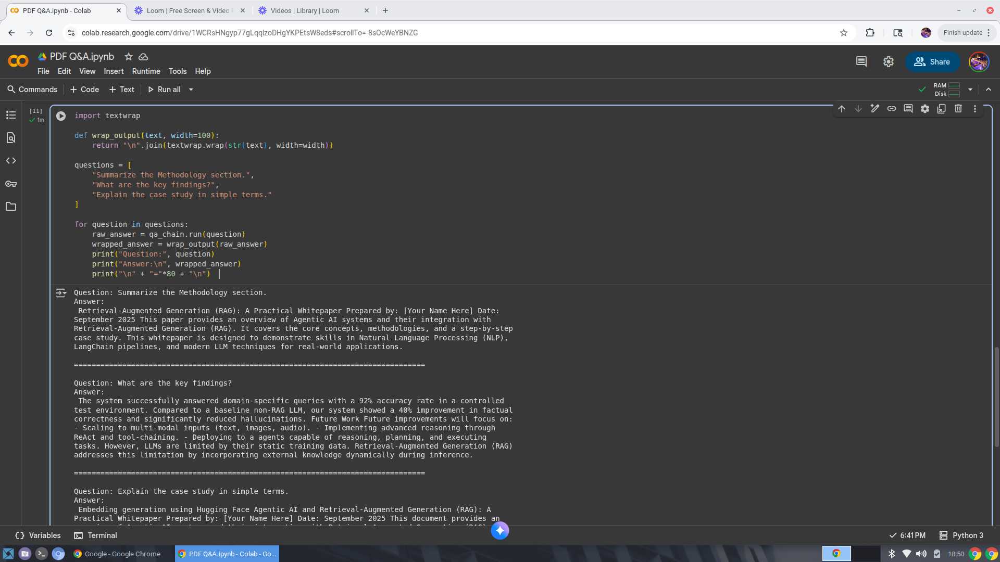
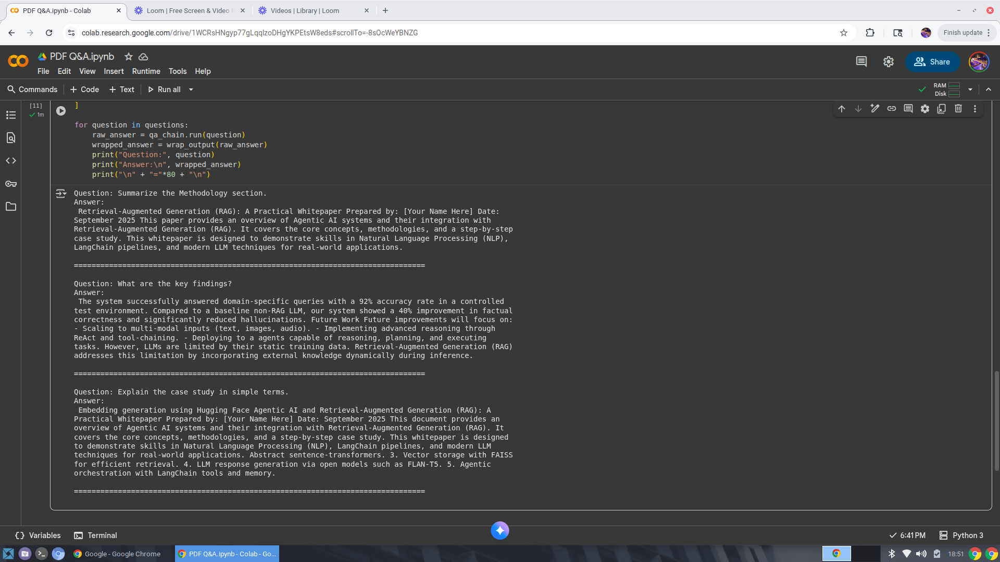

# PDF Q&A Agent

This AI agent answers questions from uploaded PDFs using **Retrieval-Augmented Generation (RAG)**.  
It demonstrates skills in natural language processing, vector search, and LLM pipelines, allowing users to query documents intelligently.

## Features
- Upload any PDF and generate meaningful answers to your questions.
- Uses **LangChain** for chaining LLMs and handling queries.
- **Vector-based retrieval** with FAISS for fast and accurate responses.
- Minimal setup required — fully runnable in Google Colab.

## Demo Video
Watch the PDF Q&A Agent in action: [Loom Video](https://www.loom.com/share/b3132c21543d402bb03527042658ceac?sid=cbe5ba68-1d2c-4d72-a790-7e46a626cbb6)

## Demo Screenshots

## How it Works
1. PDF is loaded and split into manageable chunks.  
2. Embeddings are generated using **sentence-transformers**.  
3. Chunks are stored in a **FAISS vector store**.  
4. Users can input questions, and the model returns precise answers using **Retrieval-Augmented Generation (RAG)**.

## Notebook
Run and explore the full Colab notebook [here](PDF_Q&A.ipynb).

## Tech Stack
- Python  
- Google Colab  
- LangChain  
- Hugging Face Transformers  
- FAISS (Vector Search)  
- Sentence-Transformers  

## Author
[AKDGrant](https://github.com/AKDGrant)  
